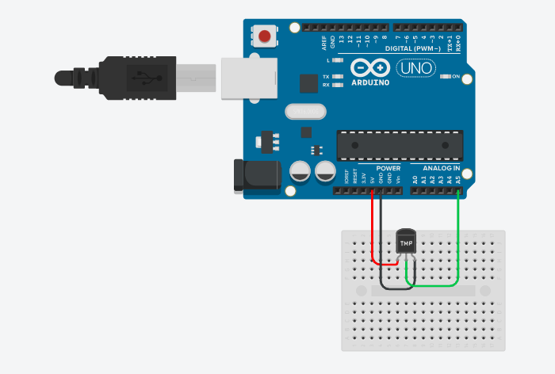

# projeto_de_aquitetura

Vamos desenvolver como o protótipo ( com o arduíno) do dispositivo oferecido pela Frozen Time.

Essa é a planta de desenvolvimento, do nosso protótipo com sensor de temperatura.

